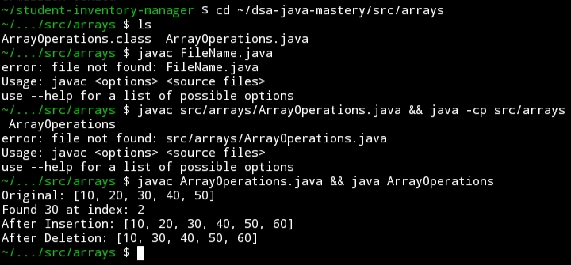
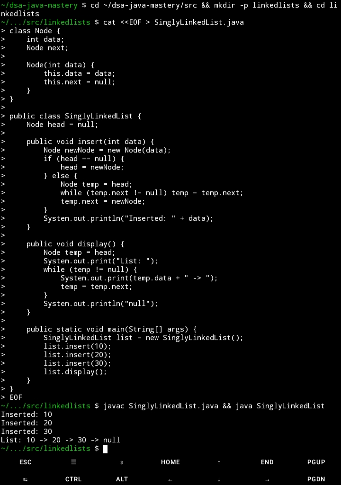
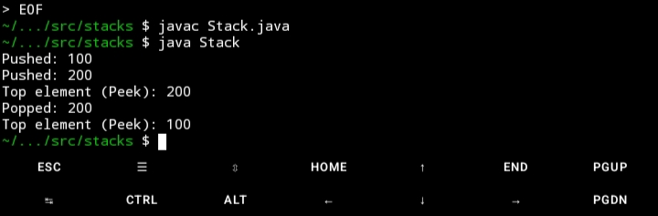
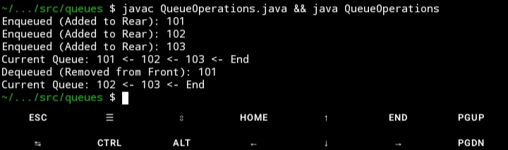
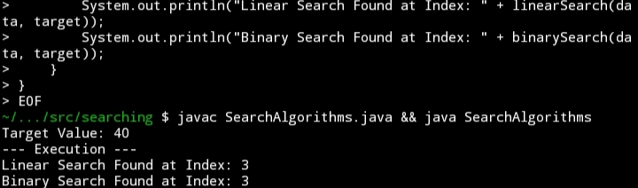
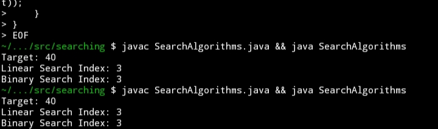
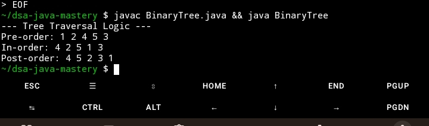
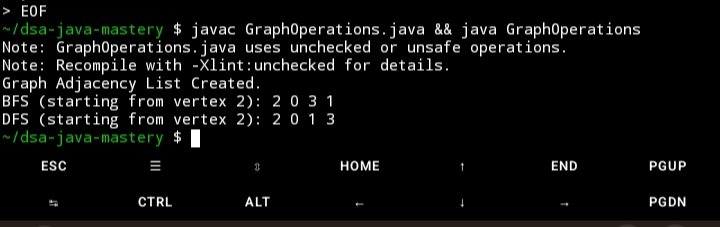

# 🚀 DSA Java Mastery: Logic Laboratory
  


A high-performance repository demonstrating the implementation of fundamental Data Structures and Algorithms (DSA) using Java. This project serves as a technical showcase of algorithmic efficiency, memory management, and clean code principles.

## 🎯 Technical Objectives
* **Algorithm Optimization:** Implementing search and sort logic with a focus on Big O notation and time/space complexity.
* **Memory Management:** Building custom data structures (Linked Lists, Trees, Graphs) to understand pointer manipulation and heap/stack allocation.
* **Technical Proficiency:** Demonstrating mastery of the Java Collections Framework and Object-Oriented Programming (OOP).

## 🛠️ Core Competencies

## 📊 Complexity Analysis (Efficiency Standards)

| Data Structure | Best Case | Average Case | Space Complexity |
| :--- | :--- | :--- | :--- |
| **Array (Search)** | (1)$ | (n)$ | (1)$ |
| **Binary Search** | (1)$ | (\log n)$ | (1)$ |
| **Bubble Sort** | (n)$ | (n^2)$ | (1)$ |
| **BST (Search)** | (1)$ | (\log n)$ | (n)$ |
| **Graph (BFS/DFS)** | (V+E)$ | (V+E)$ | (V)$ |

* **Linear Data Structures:** Arrays, Singly Linked Lists, Stacks (LIFO), and Queues (FIFO).
* **Non-Linear Data Structures:** Binary Search Trees (BST) and Directed/Undirected Graphs.
* **Traversal & Search:** BFS/DFS, Linear Search, and Binary Search.
* **Sorting Efficiency:** Bubble Sort, Selection Sort, and foundational understanding of Merge/Quick Sort.

---

## 📸 System Gallery (Proof of Work)

| Feature | Visual Preview |
| :--- | :--- |
| **Array Operations** |  |
| **Linked List Operations** |  |
| **Stack (LIFO) Logic** |  |
| **Queue (FIFO) Logic** |  |
| **Searching Algorithms** |  |
| **Sorting Algorithms** |  |
| **Tree Traversals** |  |
| **Graph BFS/DFS** |  |

---

## 🚀 Getting Started

### Prerequisites
* **Java Development Kit (JDK):** Version 8 or higher.
* **Terminal/CLI:** Termux (Android), CMD, or Bash.

### Installation & Execution
1. **Clone the repository:**
   ```bash
   git clone https://github.com/YOUR_USERNAME/dsa-java-mastery.git
   cd dsa-java-mastery
   ```

2. **Compile and Run a specific module (e.g., Trees):**
   ```bash
   javac src/trees/BinaryTree.java
   java -cp src trees.BinaryTree
   ```

> **Note:** Each directory contains an independent implementation of the data structure for modular testing.

## 💡 Technical Challenges & Solutions

### 1. Robust Data Handling
**Challenge:** Initial implementations would crash (NullPointerException) when attempting to remove elements from empty Stacks or Queues.
**Solution:** Implemented **Defensive Programming** by adding state-checks. Now, the system returns a graceful "Underflow" warning instead of terminating.

### 2. Algorithmic Efficiency
**Challenge:** Choosing between Linear and Binary Search for data retrieval.
**Solution:** Optimized retrieval by implementing Binary Search for sorted datasets, reducing time complexity from (n)$ to (\log n)$.
